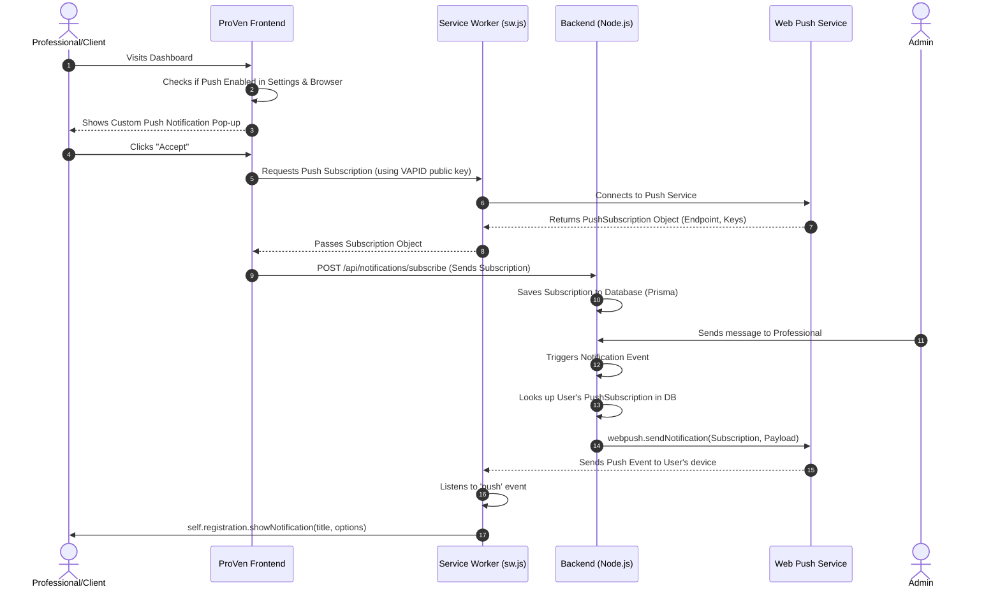

# Implement Push Notifications

We will add a complete Push Notification system that allows Admins to send push notifications to Professionals (or Clients), even when the app is closed. This involves the browser's Push API, a Service Worker, and a backend `web-push` implementation.

## Open Questions

> [!WARNING]
> Please review and confirm the following before we start building:
> 1. We will need to run a command to generate VAPID keys for the server (Public and Private keys used by the `web-push` library). I will do this in the execution phase. Is that okay?
> 2. For the settings toggle, I will add a new "Notifications" section inside the `AccountSettingsForm`. Sounds good?

## System Diagram

## Proposed Changes

---

### Backend System & Database

We will update the backend to support VAPID keys and storing push subscriptions.

#### [MODIFY] [schema.prisma](file:///c:/Users/THE%20EYE%20INFORMATIQUE/OneDrive/Desktop/All/proven/proven-backend/prisma/schema.prisma)
- Add a new `PushSubscription` model to store the endpoint and keys for each device a user subscribes from.
- Add `pushNotificationsEnabled` boolean flag to the `Profile` model (defaulting to true) to easily toggle global preference.

#### [MODIFY] Backend dependencies
- Install `web-push` and `@types/web-push` to encrypt and send payloads to the push service.

#### [NEW] Push Notification API Routes
- Create routes under `src/routes/notification.routes.ts` or a new `push.routes.ts` file to handle `subscribe`, `unsubscribe`, and saving VAPID public keys to be fetched by the frontend.

---

### Frontend UI & Service Worker

We will update the frontend to prompt users and allow them to manage settings.

#### [MODIFY] [sw.js](file:///c:/Users/THE%20EYE%20INFORMATIQUE/OneDrive/Desktop/All/proven/proven-frontend/public/sw.js)
- Implement the `push` event listener we sketched out earlier to extract the payload (Title, Body, Icon, Action Links) and display the native OS notification using `self.registration.showNotification`.

#### [NEW] PushNotificationPrompt Component
- Create a beautiful, non-intrusive pop-up that appears on the Dashboard for users who haven't accepted notifications yet. 
- It will handle the `Notification.requestPermission()` flow and subscribe via the Service Worker.
- Once accepted (or dismissed), it stores a flag in localStorage/backend to prevent showing again.

#### [MODIFY] [AccountSettingsForm.tsx](file:///c:/Users/THE%20EYE%20INFORMATIQUE/OneDrive/Desktop/All/proven/proven-frontend/components/dashboard/settings/AccountSettingsForm.tsx)
- Add a "Notifications" settings tab/section where users can globally toggle push notifications on and off. 
- Toggling off will update their Profile via API and optionally unsubscribe the current device.

## Verification Plan

### Manual Verification
1. Open the app on desktop/mobile and verify the custom prompt appears on the dashboard.
2. Accept the prompt and verify the browser asks for Notification permissions.
3. Check the database to confirm the `PushSubscription` was saved.
4. Verify the toggle in the Profile Settings functions correctly.
5. Provide a test route (e.g. `/api/notifications/test-push`) to simulate an admin message and verify the push notification appears on the desktop/mobile device!
